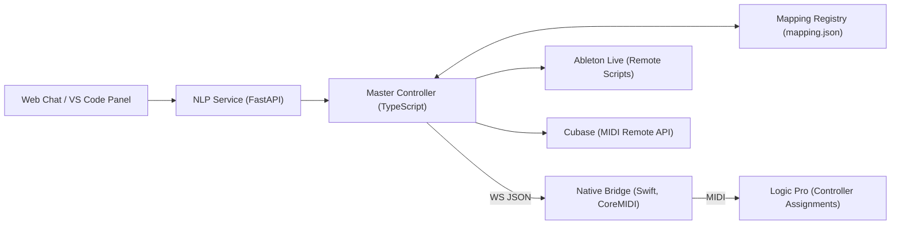

# Fadebender — Multi-DAW NLP Conductor (MVP Plan)

> **Project name:** **Fadebender**  
> **Alt options:** MixPilot, Condukt, BusDriver, FaderPilot, OrchestrAID

**Goal:** Build a minimal, demo-ready system where a user types natural language (or speaks) and DAW parameters change accordingly. Start with **Logic Pro** (your comfort zone), then add **Ableton Live** (best technical fit for product), then **Cubase**.

---

## 0) High-level Scope

- **MVP v0.1 (Logic-first)**  
  - Chat: “set Track 1 volume to –6 dB” → Track 1 fader moves.  
  - Pipeline: NLP → Master Controller → macOS Bridge → Logic Controller Assignments.  
  - Also include a “How do I…” help chat.

- **MVP v0.2 (Ableton)**  
  - Same core, but use Remote Scripts API to read/write track/device states.  
  - Can confirm changes and mirror state.

- **MVP v0.3 (Cubase)**  
  - Use MIDI Remote API (Cubase 12+). Two-way mapping possible.

---

## 1) Repo & Folder Setup

```
fadebender/
  README.md
  /docs/
    roadmap.md
    api.md
  /nlp-service/                # Python FastAPI (rules now, LLM later)
    app.py
    requirements.txt
    intents/
      parser.py
      patterns.yml
      tests/
  /master-controller/          # TypeScript core
    src/
      index.ts
      mapping.ts
      scaling.ts
      execute.ts
      types.d.ts
      adapters/
        logic.ts
        ableton.ts
        cubase.ts
    test/
    package.json
  /native-bridge-mac/          # Swift bridge for CoreMIDI
    BridgeApp.xcodeproj/
    Sources/
      AppDelegate.swift
      WebSocketServer.swift
      MidiOut.swift
    README.md
  /clients/
    /web-chat/                 # Minimal React UI
    /vscode-extension/         # Optional VS Code panel
  /configs/
    mapping.json               # one-track mapping for v0.1
  /scripts/
    seed_mapping.py
    send_test_cc.py
```

---

## 2) Architecture (MVP)



---

## 3) Data Contracts

**Intent (NLP → Controller)**

```json
{
  "intent": "set_parameter",
  "targets": [{"track": "Track 1", "plugin": null, "parameter": "volume"}],
  "operation": {"type": "absolute", "value": -6, "unit": "dB"},
  "meta": {"utterance": "set track one volume to minus six dB"}
}
```

**Bridge Message (Controller → Bridge)**

```json
{
  "op": "emit_cc",
  "payload": [{"cc": 20, "channel": 1, "value": 96, "target": "Track 1 Volume"}]
}
```

---

## 4) Mapping Registry (v0.1)

```json
{
  "version": 1,
  "mappings": [
    {
      "alias": "track1.volume",
      "logic_target": {"track": "Track 1", "parameter": "volume"},
      "midi": {"cc": 20, "channel": 1},
      "scale": {"type": "linear", "in_min": -60, "in_max": 6, "out_min": 0, "out_max": 127}
    }
  ]
}
```

---

## 5) Component Specs

### NLP Service (FastAPI)
- `POST /parse` → intent JSON  
- `POST /howto` → DAW help answers  
- Start with regex + rules, LLM later.

### Master Controller (TS)
- Loads mapping.json  
- `executeIntent()` → resolve targets, scale values, send to Bridge  
- Maintains shadow state

### Native Bridge (Swift)
- Creates CoreMIDI virtual port `Fadebender Out`  
- WebSocket server at `localhost:17890`  
- Accepts JSON → emits CCs

---

## 6) Logic Pro Setup (v0.1)

1. Open **Controller Assignments (Expert view)** → click Learn.  
2. Move **Track 1 Volume**.  
3. From script, send **CC#20**.  
4. Logic maps Track 1 Volume ↔ CC20.  
5. Now NLP → fader move works.

---

## 7) Ableton Adapter (v0.2)

- Create Remote Script in `User Library/Remote Scripts/Fadebender/`.  
- Expose TCP/WS channel.  
- Implement `set`, `get`, and `event` for parameters.  
- Example:

```json
// Controller → Ableton Script
{ "op": "set", "track": 1, "device": "Reverb", "param": "Dry/Wet", "value": 0.25 }

// Ableton Script → Controller
{ "op": "event", "track": 1, "param": "Volume", "value": -6.0 }
```

---

## 8) Cubase Adapter (v0.3)

- Use Cubase 12+ MIDI Remote API (JS/TS).  
- Create a virtual surface and map track/device params.  
- Enable feedback to Controller.

---

## 9) Dev Quickstart

```bash
# Clone repo
git clone <repo> fadebender && cd fadebender

# NLP
cd nlp-service
python -m venv .venv && source .venv/bin/activate
pip install -r requirements.txt
uvicorn app:app --reload &

# Controller
cd ../master-controller
npm i && npm run dev &

# Bridge (Swift)
open native-bridge-mac/BridgeApp.xcodeproj
# Run from Xcode
```

---

## 10) Milestones

- **M1 (Day 1–3):** Bridge up, CC test moves Logic fader.  
- **M2 (Day 4–6):** NLP → Controller → Logic (absolute volume).  
- **M3 (Day 7–10):** Add relative ops, pan, reverb wet.  
- **M4 (Day 11–14):** Ableton adapter (track vol/pan, device wet).  
- **M5 (Day 15–18):** Ableton feedback + scenes/macros groundwork.

---

## 11) Example Utterances

- “set track one volume to minus six dB”  
- “make track one two dB louder”  
- “pan track one left 20%”  
- “increase reverb wet by 10%”  
- “how do I sidechain the pad to the kick in Logic?”

---

